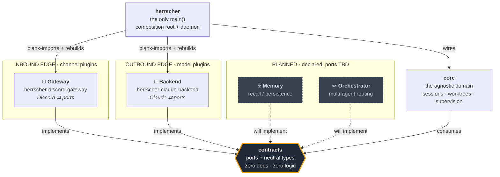
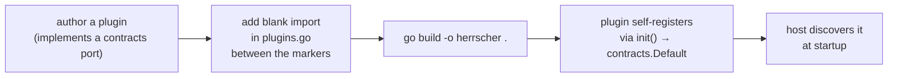
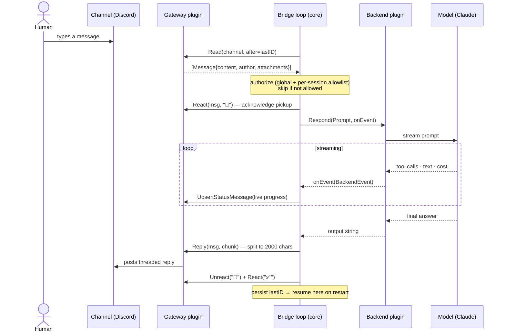
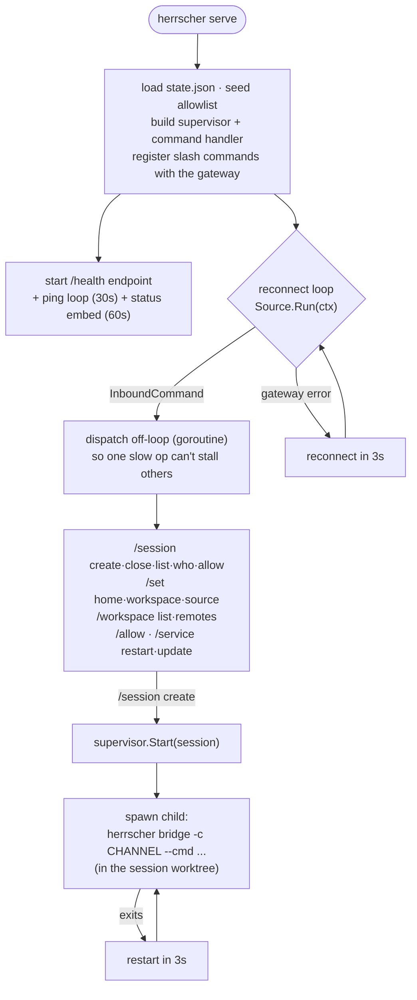
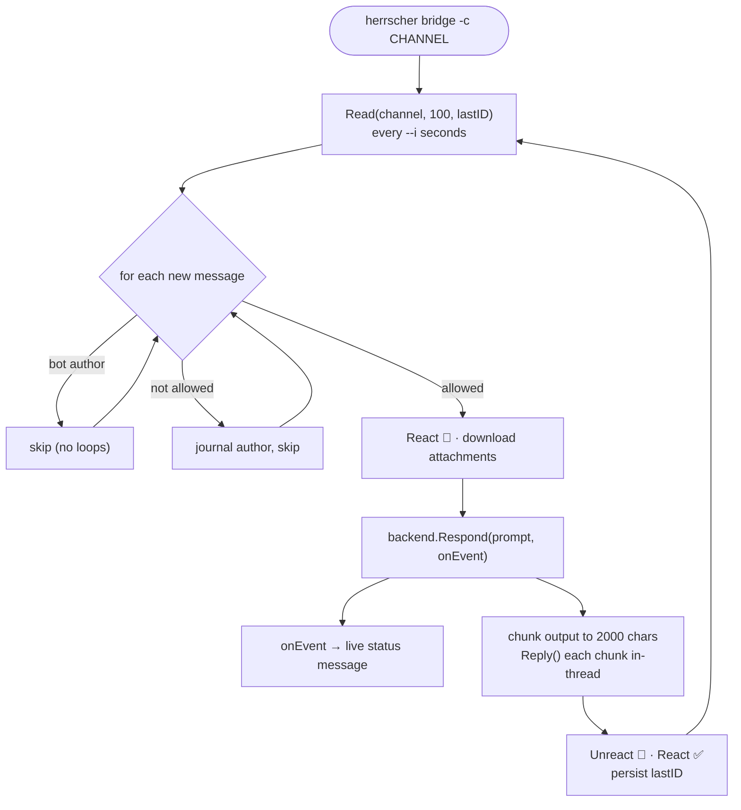
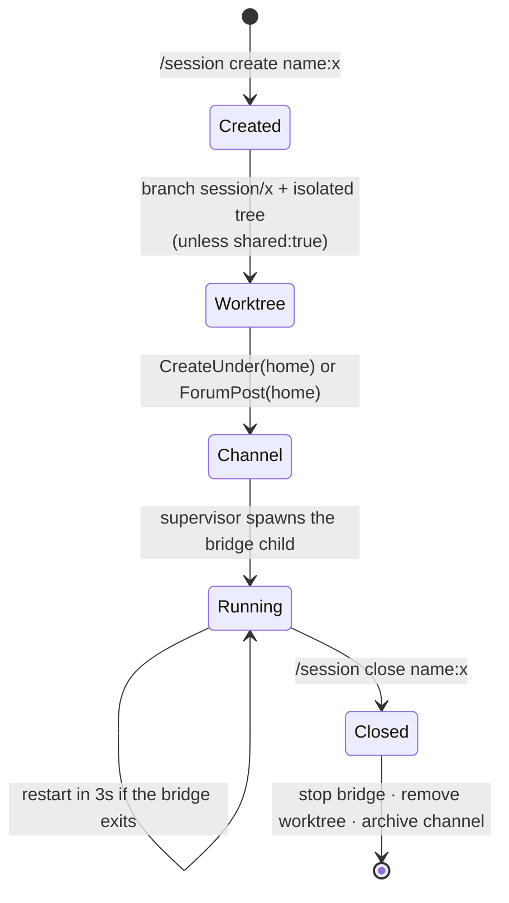

# Herrscher

**A self-hosted bridge between a chat platform and an AI agent.** You run one
daemon. It brings a bot online 24/7, exposes slash commands to spin up isolated
**sessions**, and for each session it turns your messages into prompts, asks a
model, and posts the answer back — streaming tool activity and cost as it goes.
Every session can run in its own git worktree, so an agent works on real code in
isolation.

This is the **single binary**: the agnostic domain (`core`), the composition root
and daemon, and the plugin-management CLI all live here in one module. The
swappable edges — the channel gateway and the model backend — stay in their own
repos and are compiled in.

> Built with hexagonal architecture: a narrow contract package in the middle,
> interchangeable edges (the channel, the model), an agnostic domain, and a host
> that bolts them together. Swapping Discord for Slack, or Claude for another
> model, is a one-file wiring change — never a domain rewrite.

---

## Table of contents

- [The mental model](#the-mental-model)
- [Architecture at a glance](#architecture-at-a-glance)
- [The plugin model — four categories](#the-plugin-model--four-categories)
- [The members](#the-members)
- [How a message flows](#how-a-message-flows)
- [The two run modes](#the-two-run-modes)
- [Session lifecycle](#session-lifecycle)
- [Installation](#installation)
- [CLI reference](#cli-reference)
- [Managing plugins](#managing-plugins-the-plugin--update--install-verbs)
- [Layout & wiring](#layout--wiring)
- [Configuration](#configuration)
- [Roadmap](#roadmap)

---

## The mental model

Herrscher has exactly **one job**: route. Someone says something on a channel →
the platform figures out which agent session that conversation belongs to →
forwards it to a model → posts the answer back. The domain in the middle
(`core`) never knows *who* is speaking or *which* model answers. It only knows
the **ports** declared in `contracts`.

Two facts hold the whole design together:

1. **`contracts` is the authority.** It dictates the shape every plugin must
   implement, and contains zero platform-specific mechanics. No "Discord", no
   "Claude" — just neutral ports and types.
2. **All dependency arrows point toward `contracts`.** The core depends on no
   edge; the edges depend on no core. Only the host (the binary's `main`) ever
   sees both concrete types at once, in a single wiring file.

---

## Architecture at a glance



**The golden rule** is the arrows above: everything points *in* toward
`contracts`. That is what makes the edges swappable and the domain stable.

---

## The plugin model — four categories

Plugins are compiled **into** the single binary (the [xcaddy] pattern): you add a
blank import and rebuild — no dynamic loading, no separate processes. Each plugin
self-registers into the global `contracts.Default` registry from its `init()`,
before any token or runtime config exists. The host then asks the registry for
what it needs at startup and instantiates it with live config.

[xcaddy]: https://github.com/caddyserver/xcaddy

`contracts` declares **four** plugin categories:

| Category | Edge | Port(s) | Status | Official plugin |
|----------|------|---------|--------|-----------------|
| 🔌 **Gateway** | channel (inbound) | `Gateway`, `ChannelSource`, `ChannelReader`, `ChannelAdmin`, `CommandRegistrar`, `Prober`, `MenuRouter`, `Responder` | ✅ live | [herrscher-discord-gateway] |
| 🧠 **Backend** | model (outbound) | `Backend` (+ `ChoiceAware`, `ChoiceInjector`) | ✅ live | [herrscher-claude-backend] |
| 🗄️ **Memory** | recall / persistence | *declared; port TBD* | 🚧 planned | — |
| 🪢 **Orchestrator** | multi-agent routing | *declared; port TBD* | 🚧 planned | — |

[herrscher-discord-gateway]: https://github.com/Herrscherd/herrscher-discord-gateway
[herrscher-claude-backend]: https://github.com/Herrscherd/herrscher-claude-backend

**Gateway** and **Backend** are fully implemented and shipping. **Memory** and
**Orchestrator** are reserved seats at the table: the category constants exist in
`contracts`, the architecture is shaped to receive them, but their port interfaces
are not designed yet. When they land, they plug in exactly like the other two —
a blank import and a rebuild, no domain change.



Optional ports may be **nil**: the host wraps the gateway in a degrading decorator
(`contracts.Degrade`) so a plugin that can't, say, render select-menus simply
falls back to plain text instead of crashing.

---

## The members

This repo holds the **binary** and everything agnostic that ships inside it. One
external module stays separate by design: `contracts`, so third-party plugins can
import the ports without pulling in the host.

| Location | Repo | Role |
|----------|------|------|
| `core/` (this repo) | — | The agnostic domain: sessions, channels, worktrees, supervision. |
| `main.go`, `serve.go`, … (this repo) | — | The composition root + Discord CLI — the daemon. |
| `manage/` (this repo) | — | The plugin-composition CLI (`plugin` / `update` / `install`). |
| external module | [herrscher-contracts] | The ports: interfaces + neutral types. Zero deps, zero logic. |

[herrscher-contracts]: https://github.com/Herrscherd/herrscher-contracts

The **edges** are interchangeable plugins, each its own repo, **not** part of the
binary's module — they are the official Gateway and Backend listed in the table above.
[`dctl`] is not a family member either: it is an external dependency, the
low-level Discord REST/WebSocket client the gateway consumes (currently being
rewritten from scratch).

[`dctl`]: https://github.com/Herrscherd/dctl

---

## How a message flows

End to end, from a human typing in a channel to the reply landing back:



If the model hits a permission prompt mid-turn, the backend exposes a
`PendingChoice`; when a control socket and the `MenuRouter` capability are both
present, the bridge posts a **select menu** keyed to the session, the daemon
forwards the click back over the socket, and the choice is injected into the live
session (`InjectChoice`). Otherwise it degrades to a plain-text prompt.

---

## The two run modes

The same binary runs in two shapes. **`serve`** is the always-on daemon you
install as a service; it supervises one **`bridge`** child process per session.

### `serve` — the always-on daemon



### `bridge` — the per-session poll loop



State (the last-seen message id) is persisted every message, so a restarted
bridge resumes exactly where it left off. Authorization re-reads the daemon's
`state.json` only when the file's mtime changes — cheap per-poll.

---

## Session lifecycle

A **session** is the unit of work: a channel + an agent + (optionally) an isolated
git worktree, supervised by a long-lived bridge.



- `project:` picks an existing repo from your workspace; `clone:` forges one
  first (gh/glab). `shared:true` skips the worktree and runs in the main checkout.
- `/session close` refuses to delete a worktree with uncommitted work unless you
  pass `force:true`.
- `/session allow` and `/allow` gate who may *drive* a session; everyone else is
  observed (journaled for `/session who`) but never executes.

---

## Installation

### Prerequisites

- Go 1.23+
- A Discord bot token (the official Gateway is Discord)
- All family repos checked out **side by side** (the dev build uses `replace`
  directives pointing at the siblings).

```bash
# clone the whole family next to each other
mkdir herrscher-dev && cd herrscher-dev
for r in herrscher herrscher-contracts \
         herrscher-discord-gateway herrscher-claude-backend dctl; do
  git clone https://github.com/Herrscherd/$r.git
done
```

### Build the single binary

```bash
cd herrscher
go build -o herrscher .          # the only binary; plugins are compiled in
```

### Run it directly (foreground)

```bash
export DISCORD_BOT_TOKEN=...      # required
export DCTL_OWNER_ID=...          # optional: seeds the allowlist with you

./herrscher serve --health-addr :8787
```

Then in Discord: `/set home #your-category`, `/session create name:hello`, and
start talking in the session channel.

### Install as a boot-started service (recommended)

`herrscher service install` writes a native service for your OS and a `0600`
secrets template — it never bakes the token into the unit file.

```bash
./herrscher service install \
  --cmd "claude --model claude-opus-4-8 --effort low" \
  --health-addr :8787
```

| OS | What it creates |
|----|-----------------|
| **Linux** | systemd **user** unit `~/.config/systemd/user/dctl.service` (`Restart=always`), enables it, runs `loginctl enable-linger` so it survives logout |
| **macOS** | launchd LaunchAgent `~/Library/LaunchAgents/com.vskstudio.dctl.plist` (`RunAtLoad`, `KeepAlive`) |
| **Windows** | a Task Scheduler task `dctl` (on-logon trigger) wrapping `herrscher serve` |

It also scaffolds (never clobbering existing files):

- `~/.config/dctl/dctl.env` — the secrets file the service sources
  (`DISCORD_BOT_TOKEN=`, `DISCORD_CHANNEL_ID=`, `DCTL_OWNER_ID=`)
- `~/.config/dctl/config.json` — the config template (see [Configuration](#configuration))

Then fill the token and (re)start:

```bash
$EDITOR ~/.config/dctl/dctl.env      # set DISCORD_BOT_TOKEN
./herrscher service restart
./herrscher service status
```

### Update an installed service

```bash
cd herrscher
./herrscher service update           # git pull --ff-only, rebuild the installed binary, restart
./herrscher service update --no-pull # rebuild from local source only
```

`service update` rebuilds the **installed** binary (not the one you invoked) and
schedules the restart out-of-band (on Linux via `systemd-run`), so it survives the
daemon being killed mid-restart.

### Uninstall

```bash
./herrscher service uninstall        # disable + remove the unit (leaves your config/secrets)
```

---

## CLI reference

`herrscher <command>`. The daemon doubles as a token-frugal Discord CLI; output
is deliberately minimal (ids and one-line messages) so an agent reading stdout
spends few tokens.

| Command | What it does |
|---------|--------------|
| `serve [--config PATH] [--state FILE] [--health-addr ADDR] [--status-channel ID] [--env-file PATH] [--instance SLUG] [--cmd '…']` | The always-on Gateway daemon. Slash commands, per-session bridge supervision, health endpoint. |
| `bridge -c CHANNEL [--cmd '…'] [--backend stream\|oneshot] [--model M] [-i 5] [--state FILE] [--progress off\|actions\|full] …` | One channel ⇄ one backend poll loop. Normally spawned by `serve`, runnable standalone. |
| `service <install\|uninstall\|status\|restart\|update> [--cmd '…'] [--health-addr ADDR] [--env-file PATH] [--source DIR] [--no-pull]` | Manage the daemon as a native OS service (see [Installation](#installation)). |
| `channel <list\|create [--forum]\|post <forum_id> <title> <content>\|delete\|ensure> [--guild ID]` | Manage channels directly. |
| `send  [-c CHANNEL] <text>` | Post a message; prints its id. |
| `reply [-c CHANNEL] <message_id> <text>` | Reply in a thread; prints reply id. |
| `read  [-c CHANNEL] [-n 20] [--after ID]` | Recent messages, one per line (`id  author  text`). |
| `watch [-c CHANNEL] [-i 10] [--after ID]` | Stream new messages forever. |
| `react [-c CHANNEL] <message_id> <emoji>` | Add a reaction. |
| `thread [-c CHANNEL] <message_id> <name>` | Open a real thread off a message. |

**Environment:** `DISCORD_BOT_TOKEN` (required), `DISCORD_CHANNEL_ID` (default
channel), `DCTL_OWNER_ID` (seed allowlist), `DCTL_STATE_DIR` (state dir, default
`~/.config/dctl`), `DCTL_INSTANCE_ID` (namespace slug for shared resources).

---

## Managing plugins (the `plugin` / `update` / `install` verbs)

The same binary manages its own plugin composition (the `manage/` package). These
verbs do **not** run the runtime; they edit `plugins.go` (the blank-import list
between the `herrscher:plugins` / `herrscher:end` markers) and rebuild.

```bash
herrscher plugin list                              # compiled-in plugins
herrscher plugin add github.com/acme/slack-gateway # blank-import, go get, tidy, build
herrscher plugin remove github.com/acme/slack-gateway
herrscher update                                   # go get -u every plugin, tidy, rebuild
herrscher install -- --health-addr :8787           # build the host, then delegate to `service install`
```

`herrscher update` refreshes the **plugin** modules (the counterpart to
`herrscher service update`, which pulls the host's own source). `herrscher
install` builds the binary then forwards everything after `--` to `herrscher
service install` — it never reimplements the systemd/launchd glue.

---

## Layout & wiring

The binary is one Go module (`core/`, `manage/`, and the root `main` package).
The contracts module and the edge plugins are separate modules, stitched in
during development with `replace` directives at sibling paths, so the repos must
sit side by side:

```
herrscher-dev/
├── herrscher/                 ← the only main(); core + manage + plugins.go (this repo)
│   ├── core/                  ← the agnostic domain
│   └── manage/                ← the plugin-composition CLI
├── herrscher-contracts/       ← the ports (separate module)
├── herrscher-discord-gateway/ ← Gateway plugin (separate module)
├── herrscher-claude-backend/  ← Backend plugin (separate module)
└── dctl/                      ← external dependency (Discord client, being rewritten)
```

The `replace` directives resolve only when the siblings are checked out alongside
this repo.

---

## Configuration

Precedence, highest first: **CLI flag → environment → `config.json` → built-in
default**. The service sources secrets from a separate `0600` env file so they
never live in the unit.

`~/.config/dctl/config.json`:

```json
{
  "cmd": "claude --model claude-opus-4-8 --effort low",
  "healthAddr": ":8787",
  "statusChannel": "",
  "instance": "",
  "owner": "",
  "home": { "id": "category_or_forum_id", "type": "category" },
  "workspace": "/path/to/projects",
  "source": "/path/to/herrscher/checkout"
}
```

- `cmd` — the base bridged command for new sessions (a per-session `cmd:` overrides it).
- `home` — where `/session create` puts channels (a category or a forum), set via `/set home`.
- `workspace` — root scanned for `project:` and shown by `/workspace list`.
- `source` — checkout `/service update` rebuilds from.

---

## Roadmap

- **Memory plugins** — a `Memory` port for recall/persistence across sessions
  (category already declared in `contracts`).
- **Orchestrator plugins** — an `Orchestrator` port for multi-agent routing
  (category already declared in `contracts`).
- **Distributed transport** — the in-process registry (`Manifest`, factories) is
  shaped so the channel/model/domain split can later run over **NATS/gRPC** as a
  wiring change, not a rewrite.

---

## A note on history

The platform grew out of a Go monolith (`dctl`) that bridged Discord to a local
Claude. Herrscher is that monolith decomposed along its natural seams — channel,
model, domain — so each can evolve independently. The contract shapes were chosen
deliberately to make the eventual transport change (in-process → NATS/gRPC) a
detail, not a rewrite.
