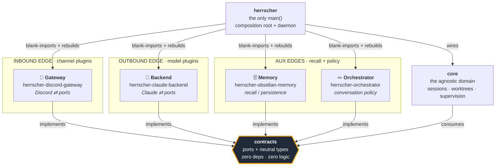
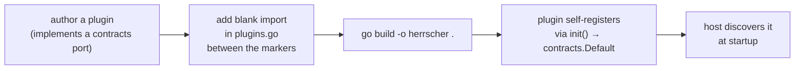
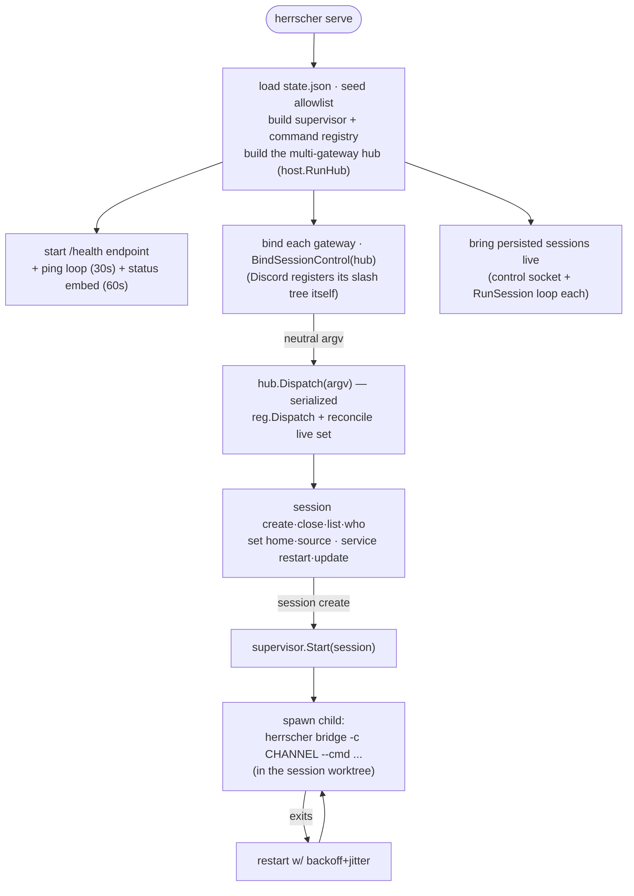
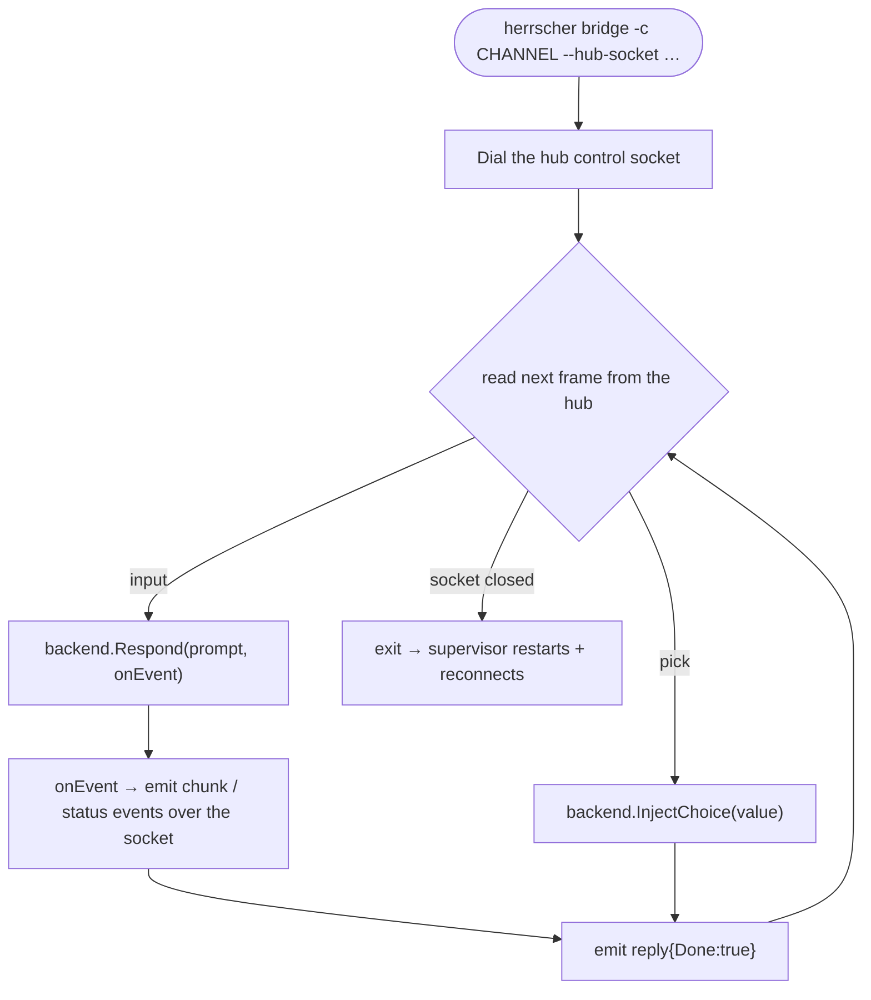
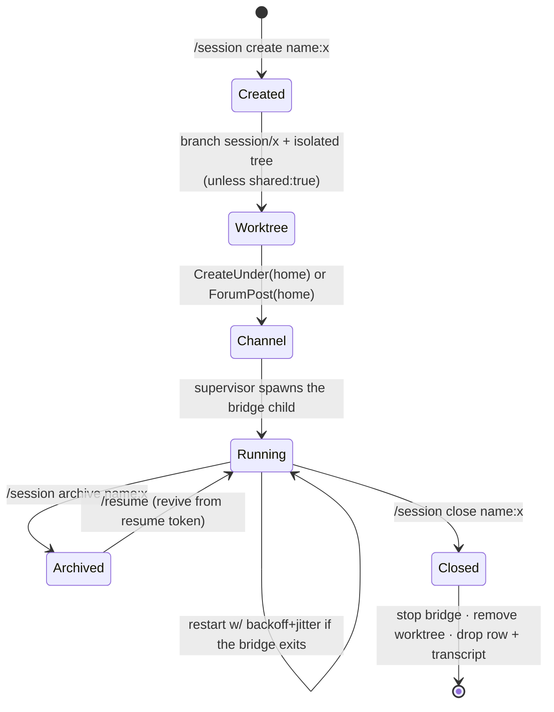

# Herrscher

**A self-hosted bridge between a chat platform and an AI agent.** You run one
daemon. It brings a bot online 24/7, exposes slash commands to spin up isolated
**sessions**, and for each session it turns your messages into prompts, asks a
model, and posts the answer back — streaming tool activity and cost as it goes.
Every session can run in its own git worktree, so an agent works on real code in
isolation.

This is the **single binary**: the agnostic domain (`core`), the composition root
and daemon, and the plugin-management CLI all live here in one module. The
swappable edges — the channel gateway, the model backend, memory and the
orchestrator — stay in their own repos and are compiled in. The host itself is
**gateway-agnostic**: it imports no concrete Discord client and drives chat
platforms only through the contracts `Gateway` port — an invariant
guarded by purity tests (`TestHostPurity`, `TestCorePurity`, and
`TestCoreNamesNoConcretePlatform`, which greps every `core/` source file and
fails the build if the literal name of a concrete platform appears anywhere —
code, comment, or test fixture).

> Built with hexagonal architecture: a narrow contract package in the middle,
> interchangeable edges (the channel, the model), an agnostic domain, and a host
> that bolts them together. Swapping Discord for Slack, or Claude for another
> model, is a one-file wiring change — never a domain rewrite.

---

## Table of contents

- [The mental model](#the-mental-model)
- [Architecture at a glance](#architecture-at-a-glance)
- [The plugin model — four categories](#the-plugin-model--four-categories)
- [The members](#the-members)
- [How a message flows](#how-a-message-flows)
- [Cross-backend skills](#cross-backend-skills)
- [The two run modes](#the-two-run-modes)
- [Session lifecycle](#session-lifecycle)
- [Inter-session coordination](#inter-session-coordination)
- [Durable agents](#durable-agents)
  - [Memory scope (shared vs private)](#memory-scope-shared-vs-private)
  - [Learning (the write side)](#learning-the-write-side)
- [Installation](#installation)
- [CLI reference](#cli-reference)
- [Managing plugins](#managing-plugins-the-init--plugin--update--install-verbs)
- [Layout & wiring](#layout--wiring)
- [Configuration](#configuration)
- [Roadmap](#roadmap)

---

## The mental model

Herrscher has exactly **one job**: route. Someone says something on a channel →
the platform figures out which agent session that conversation belongs to →
forwards it to a model → posts the answer back. The domain in the middle
(`core`) never knows *who* is speaking or *which* model answers. It only knows
the **ports** declared in `contracts`.

Two facts hold the whole design together:

1. **`contracts` is the authority.** It dictates the shape every plugin must
   implement, and contains zero platform-specific mechanics. No "Discord", no
   "Claude" — just neutral ports and types.
2. **All dependency arrows point toward `contracts`.** The core depends on no
   edge; the edges depend on no core. Only the host (the binary's `main`) ever
   sees both concrete types at once, in a single wiring file.

---

## Architecture at a glance



**The golden rule** is the arrows above: everything points *in* toward
`contracts`. That is what makes the edges swappable and the domain stable.
Neither the host nor `core` ever imports a concrete adapter: no concrete Discord
client appears anywhere in this module — it lives only in the Discord gateway plugin. The host
talks to every chat platform through the contracts `Gateway` port, and that
invariant is enforced by `TestHostPurity` (root) and `TestCorePurity` (`core/`),
which fail the build if a concrete client ever leaks in. `core` goes one step
further: it may not even *name* a concrete platform. Gateway kinds are injected
at the composition root and flow through `core` as opaque data — the daemon's
default set, a session's bound kinds, the SSRF allowlist for attachment
downloads, even the `.env` secrets template (rendered from each gateway
manifest's declared vars) all stay platform-blind. `TestCoreNamesNoConcretePlatform`
enforces this to the letter: it fails if the string `discord` appears anywhere
under `core/`.

---

## The plugin model — four categories

Plugins are compiled **into** the single binary (the [xcaddy] pattern): you add a
blank import and rebuild — no dynamic loading. Each plugin self-registers into the
global `contracts.Default` registry from its `init()`, before any token or runtime
config exists. The host then asks the registry for what it needs at startup and
instantiates it with live config. They run **in-process by default**; a category
can opt into running as a **separate process** over the NATS/gRPC transport (see
[Roadmap](#roadmap)) with no plugin code change.

[xcaddy]: https://github.com/caddyserver/xcaddy

`contracts` declares **four** plugin categories:

| Category | Edge | Port(s) | Status | Official plugin |
|----------|------|---------|--------|-----------------|
| 🔌 **Gateway** | channel (inbound) | `Gateway`, `ChannelSource`, `ChannelReader`, `ChannelAdmin`, `CommandRegistrar`, `Prober`, `MenuRouter`, `Responder`, `EventSink` (smart gateways), `Foreground` (a gateway that owns the main thread, e.g. a TUI) | ✅ live | [herrscher-discord-gateway], in-tree `terminal` |
| 🧠 **Backend** | model (outbound) | `Backend` (+ `ChoiceAware`, `ChoiceInjector`) | ✅ live | [herrscher-claude-backend], [herrscher-codex-backend], [herrscher-cursor-backend] |
| 🗄️ **Memory** | recall / persistence | `Memory` | ✅ live | [herrscher-obsidian-memory] |
| 🪢 **Orchestrator** | conversation policy | `Orchestrator` | ✅ live | [herrscher-orchestrator] |

[herrscher-discord-gateway]: https://github.com/Herrscherd/herrscher-discord-gateway
[herrscher-claude-backend]: https://github.com/Herrscherd/herrscher-claude-backend
[herrscher-codex-backend]: https://github.com/Herrscherd/herrscher-codex-backend
[herrscher-cursor-backend]: https://github.com/Herrscherd/herrscher-cursor-backend
[herrscher-obsidian-memory]: https://github.com/Herrscherd/herrscher-obsidian-memory
[herrscher-orchestrator]: https://github.com/Herrscherd/herrscher-orchestrator

All four categories have an official plugin. **Orchestrator** is a
conversation-policy port; the default stack ships the published
`herrscher-orchestrator` module (the `basic` kind). Every plugin plugs in the
same way — a blank import and a rebuild, no domain change.

Gateways come in two flavours. A plain gateway exposes only the read/post ports;
for it the host posts **only the final reply** (chunked), with no platform-
specific dressing. A **smart gateway** also implements `EventSink`, receives the
raw turn-event stream, and renders it itself (live progress, emojis, summary).
Both shipped gateways are smart: the in-tree **`terminal`** gateway
(`plugins/terminal`) is a Bubbletea TUI that `serve` brings up in the foreground
as a first-class peer of Discord, and the **Discord** gateway renders its own
progress message, ⏳ acknowledgement, and summary via DCTL. Rich, platform-
specific presentation lives in the gateway — never in the host: the host only
emits **abstract semantic events** (turn received, reply, mid-turn reset, and an
`abandoned` signal when a turn ends without a reply), and each gateway decides
how to display them. The host never picks an emoji or reaction itself.



Optional ports may be **nil**: the host wraps the gateway in a degrading decorator
(`contracts.Degrade`) so a plugin that can't, say, render select-menus simply
falls back to plain text instead of crashing.

---

## The members

This repo holds the **binary** and everything agnostic that ships inside it. One
external module stays separate by design: `contracts`, so third-party plugins can
import the ports without pulling in the host.

| Location | Repo | Role |
|----------|------|------|
| `core/` (this repo) | — | The agnostic domain: sessions, channels, worktrees, supervision. |
| `main.go`, `serve.go`, … (this repo) | — | The composition root and daemon — gateway-agnostic, drives platforms only through the `Gateway` port. |
| `manage/` (this repo) | — | The plugin-composition CLI (`init` / `plugin` / `update` / `install`). |
| external module | [herrscher-contracts] | The ports: interfaces + neutral types. Zero deps, zero logic. |

[herrscher-contracts]: https://github.com/Herrscherd/herrscher-contracts

The **edges** are interchangeable plugins, each its own repo, **not** part of the
binary's module — they are the official Gateway, Backend, Memory and Orchestrator
listed in the table above. The **low-level Discord REST client** is not a family
member either: it is the pure, dependency-free Discord REST client (v10) the
**gateway plugin** consumes — no gateway socket, no CLI, just on-demand HTTP. The
host never imports it (it shows up only as an *indirect* dependency, pulled in
transitively by the gateway plugin).

---

## How a message flows

The **daemon (hub)** owns all gateway I/O. Each session's driver polls every
bound gateway for input, serializes those inputs through a per-session FIFO, and
hands one input frame per turn to a **pure-runner bridge** over a persistent
control socket. The bridge talks only to the backend; it streams the turn's
events back over the same socket, and the hub fans them out to every bound
gateway. One turn is active at a time: the next queued input is sent only after
the current turn ends — either its terminal `reply{done}`, or an abandonment
(bridge disconnect or shutdown), which fans out an abstract `abandoned` signal so
smart gateways can finalize their live acknowledgement.

```mermaid
sequenceDiagram
    actor U as Human
    participant CH as Channel (Discord / terminal)
    participant GW as Gateway plugin
    participant HUB as Hub session driver (core/host)
    participant BR as Bridge (pure runner)
    participant BE as Backend plugin
    participant M as Model (per session vendor: claude/codex/cursor)

    U->>CH: types a message
    HUB->>GW: Read(channel, after=lastID)
    GW-->>HUB: [Message{content, author, attachments}]
    Note over HUB: enqueue on the session FIFO<br/>(one active turn at a time)
    HUB->>BR: input frame (over control socket)
    BR->>BE: Respond(Prompt, onEvent)
    BE->>M: stream prompt
    loop streaming
        M-->>BE: tool calls · text · cost
        BE-->>BR: onEvent(BackendEvent)
        BR-->>HUB: chunk / status events
        HUB->>GW: fan out to every bound gateway<br/>(smart gateway renders itself; plain gateway gets the final reply only)
    end
    M-->>BE: final answer (+ total cost)
    BE-->>BR: output string
    BR-->>HUB: reply{Done:true, Cost}
    HUB->>GW: deliver reply event<br/>(smart: rendered in-gateway; plain: posted, split to 2000)
    GW->>CH: shows the reply
    Note over HUB: turn ends → next FIFO input may start
```

A **smart gateway** (both Discord and the terminal) implements `EventSink` and
renders the live event stream itself — progress, emojis, and a cost summary. For
a plain gateway the host only posts the final reply, chunked; it adds no
platform-specific presentation, keeping the host gateway-agnostic.

If the model hits a permission prompt mid-turn, the backend exposes a
`PendingChoice`; when the `MenuRouter` capability is present, the gateway posts a
**select menu** keyed to the session, the hub routes the click to the session's
FIFO (`Pick`), and the bridge injects the choice into the live session
(`InjectChoice`) out-of-band. Otherwise it degrades to a plain-text prompt.

---

## Cross-backend skills

A **skill** is an Anthropic-format `SKILL.md` (frontmatter `name` + `description`,
then a markdown body of instructions). Herrscher makes any such skill usable on
**every** backend — including codex and cursor, which have no native skill loader
— by replicating Claude's progressive disclosure at the bridge seam.

Skills are discovered from two roots, repo-first so a project can override a
global skill of the same name:

1. `<workspace>/.claude/skills/<name>/SKILL.md` — the session's repo (the bridge
   runs with `cwd = workspace`)
2. `~/.claude/skills/<name>/SKILL.md` — user-global

Each turn the hub (`core/bridge/hub.go:runOneTurn`) injects a cheap **menu** —
one `name: description` line per skill — into the prompt context. When the model
decides it needs one, it emits `<use-skill>NAME</use-skill>`; the engine detects
that marker, **strips it from the delivered reply**, and on the next turn injects
that skill's full body (fenced with its absolute directory, so the model can
`Read` bundled resource files by path). The two-turn round trip mirrors Claude's
native tool-call → tool-result.

Backends that load skills natively opt out via the `contracts.SkillNative`
capability (`NativeSkills() bool`): the **claude** backend returns `true`, so the
hub injects nothing and lets the CLI load skills itself — no double injection.
The neutral engine lives in the dependency-free `core/skills` package
(`Discover` + `Engine`). The roots are re-scanned at the start of every turn, so
a `SKILL.md` you add or edit mid-session is picked up without restarting it;
skills the model already activated stay active.

In the terminal TUI, **`/skills`** opens a read-only panel listing the skills
discovered under `~/.claude/skills` (plus any configured extra roots) — name and
description per row, `↑↓` to scroll, `Esc` to close.

**Config** (`~/.config/herrscher/config.json`, all optional):

```jsonc
"skills": {
  "enabled": true,          // omit or true = on; false disables injection
  "roots": ["/opt/team-skills"]  // extra roots, appended after the two defaults
}
```

---

## The two run modes

The same binary runs in two shapes. **`serve`** is the always-on daemon (the
multi-gateway **hub**, `host.RunHub`) you install as a service; it owns all
gateway I/O and supervises one pure-runner **`bridge`** child process per
session. When `serve` runs on an interactive TTY, it also runs the one bound
gateway that implements the `Foreground` capability on the main thread — the
in-tree **terminal gateway** by default, an in-process Bubbletea TUI that is a
first-class gateway peer of Discord (quitting it stops the daemon). `serve` never
imports a concrete frontend: any plugin can implement `Foreground` and replace
the default. A background service (no TTY) runs headless, hub-driven only.

> **Command surface (current):** operator commands run through a neutral
> `contracts.Cmd` registry, reachable two ways. The operator **CLI** (`herrscher
> session create|close|list|who|archive|log`, `herrscher service restart|update`,
> `herrscher set home|source`) dispatches them directly. The **Discord gateway** binds the
> same commands as slash commands: it translates each interaction into a neutral
> argv and dispatches it through the `contracts.SessionControl` seam, so the core
> never learns the Discord command surface. All slash handling (including the
> `/allow` permission lists) lives in the gateway plugin; the daemon only ever
> sees neutral argv.

### `serve` — the always-on daemon



### `bridge` — the pure-runner backend loop



The bridge does **no** gateway I/O: it never reads a channel, posts, or reacts.

### Terminal TUI — Claude-style multi-session flow

When `serve` runs on an interactive TTY, the in-tree terminal gateway (a
Bubbletea TUI) takes over the foreground; any configured Discord gateway keeps
running headless in the background. The interface is a faithful copy of the
Claude Code look: a borderless full-width message flow on a committed dark
surface carried by a single warm accent, with no enclosing card. Your input is
echoed as a dim `> …` line, agent prose renders bare full-width, and tool calls
show as a warm `● Tool(input)` line with `⎿` result continuations.

Multiple sessions run at once but the switch is invisible — there is no
permanent tab strip. `Tab` / `Shift+Tab` cycle sessions and `/session switch`
opens a modal picker; a background session that receives output is flagged
unread and clears the moment you switch to it.

**Immediate feedback.** Pressing `Enter` echoes your line and flips the session
into a working state on the spot — before the backend sends anything back — so
you always know the message was taken. While a turn is in flight a spinner line
renders the Claude progress shape: `✳ …(esc to interrupt · {n}s · ↑ {tokens} ·
${cost})`, with the live output-token count and cost filled in as they arrive.
Press `Esc` during a turn to interrupt it — the in-flight turn is cancelled and
the conversation is preserved so the next message resumes it.

**Composer.** The input is a multi-line composer: `Enter` submits the draft,
`Alt+Enter` (or `Ctrl+J`) inserts a newline, and the box grows with the draft up
to eight rows before it scrolls internally. The transcript word-wraps to the
pane width (glyph-width aware), so long lines fold instead of being clipped and
re-wrap on resize.

**Attachments.** Send images to the agent without leaving the terminal: paste an
image from the clipboard with `Ctrl+V`, or stage a local file with
`/attach <path>`. Staged attachments show as chips above the composer; `Ctrl+U`
removes the last one (with nothing staged it keeps the composer's
delete-to-line-start). Chips are echoed under your message once sent, and on a
kitty-graphics terminal (kitty, Ghostty, WezTerm) a PNG also renders as an inline
preview beneath its chip — elsewhere the chip stands alone. The host hands the
files to the backend as image blocks (clipboard/`/attach` files travel as local
`file://` paths; other gateways' CDN images download through an SSRF allowlist
first). Clipboard paste uses `wl-paste`, so it needs a Wayland session with
`wl-clipboard` installed; where that is unavailable, `Ctrl+V` falls back to
pasting text.

**Command palette & mentions.** Typing `/` opens an inline borderless palette of
the commands the terminal accepts (session and agent verbs only). It filters as
you type; `↑`/`↓` move the selection, `Tab` completes the highlighted command,
and `Esc` closes it. Typing `@` opens an inline file-mention list drawn from the
session's worktree; `Tab` inserts the highlighted path as plain text (the backend
resolves the mention). Press `?` on an empty composer for the shortcuts overlay.

**Session management.** Create, list, close, and archive sessions directly from
the TUI using slash commands — no Discord required. Type `/session create --name foo`
to spin up a new session; it comes online immediately. Use `/session list`
to see active sessions, `/session switch` to jump between them, `/session close
--name foo` to shut one down, or `/session archive --name foo` to stop the bridge
but **keep the session resumable** (its row, transcript, and resume token are
retained). Sessions are bound to the terminal and isolated by name; typing routes
your input to the active session and streams replies into its pane.

**Scrollback & resume.** Every turn is recorded to a per-session transcript. When
a session (re)opens, its recent history replays as dimmed scrollback above the live
stream, so context is never lost across a restart. Type `/resume` to open a picker
of all sessions — live and archived — sorted by last activity: `↑`/`↓` select,
`Enter` reopens a live session or revives an archived one (the backend
resumes from its stored token), `Esc` closes the picker.

It is a stateless backend runner driven entirely by the hub's input frames. The
hub owns the FIFO and connection lifecycle, so if the bridge crashes the
supervisor restarts it and it re-dials the same socket, resuming with the next
queued input. Authorization and message-id tracking live in the hub, not here.

**Keybindings.**

| Key | Action |
|-----|--------|
| `Tab` / `Shift+Tab` | Switch to next/previous session |
| `/` | Open the command palette (filters as you type) |
| `@` | Open the file-mention list from the session's worktree |
| `↑` / `↓` | Move the palette / mention / `/resume` selection while open; otherwise recall submitted prompts on an empty composer |
| `Tab` | Complete the highlighted command or mention (while its list is open) |
| `/resume` then `Enter` | Open the session picker: reopen a live session or revive an archived one |
| `Enter` | Submit the composer draft to the active session (lines starting with `/` are run as commands) |
| `Alt+Enter` / `Ctrl+J` | Insert a newline in the composer instead of submitting |
| `Ctrl+V` | Paste a clipboard image as an attachment (falls back to text paste when there is no image) |
| `/attach <path>` | Stage a local file as an attachment for the next message |
| `Ctrl+U` | Remove the last staged attachment (falls through to delete-to-line-start when none staged) |
| `Ctrl+W` then `y` | Close the active session (any other key cancels) |
| `?` (empty input) | Toggle the shortcuts overlay |
| `PgUp` / `PgDn` | Scroll the active session's transcript |
| `Esc` | Interrupt the in-flight turn, or close an open palette/picker; on an idle session, quit the TUI |
| `Ctrl+C` | Quit the TUI (shuts down the daemon) |

The status line shows the active session state (working/idle/disconnected); a
working turn renders the `✳ …(esc to interrupt · {n}s · ↑ {tokens} · ${cost})`
spinner, and an idle session shows the last turn's cost. The mouse is left
uncaptured, so selecting text to copy works with the terminal's native
selection.

---

## Session lifecycle

A **session** is the unit of work: a channel + an agent + (optionally) an isolated
git worktree, supervised by a long-lived bridge.



- `project:` picks an existing repo from your workspace; `clone:` forges one
  first (gh/glab). `shared:true` skips the worktree and runs in the main checkout.
- `/session close` refuses to delete a worktree with uncommitted work unless you
  pass `force:true`. Close is destructive: it removes the state row, worktree, and
  the recorded transcript.
- `/session archive` is the non-destructive counterpart: it stops the bridge but
  keeps the row, worktree, transcript, and resume token, marking the session
  archived. Archived sessions are skipped by the boot loop and the reconciler, so
  they never respawn a backend on their own — they come back only on demand via the
  TUI's `/resume` picker, which revives the backend from its stored resume token and
  repaints the recorded scrollback.
- `/session allow` and `/allow` gate who may *drive* a session; everyone else is
  observed (journaled for `/session who`) but never executes.
- `agent:` (CLI `--agent NAME`) provisions the session from a **durable companion
  agent**: it materializes that agent's persona and config into the session
  worktree before the channel is created. This requires an isolated git worktree —
  it is rejected with `shared:true` or a non-git project. The session records
  which agent it was provisioned from (see [Durable agents](#durable-agents)).
- **The conversation survives restarts.** Each session persists an opaque backend
  *resume token* — the model process's own conversation id, folded in from every
  turn's reply and rewritten only when it changes (no `state.json` churn). When the
  supervisor respawns the bridge — after a crash, a `service restart`, or a reboot —
  it passes that token back so the model **resumes the same conversation** instead
  of starting cold. Core never sees a vendor: the token is an opaque `string`
  carried through a neutral `ResumeAware` seam. Backends with no resume mechanism
  fall back to a fresh start, and sessions created before the feature carry no
  token and behave exactly as before.

---

## Inter-session coordination

A session's agent can spin up, hand off to, and collect other sessions without
any human in the loop. It signals an intent by ending its reply with a single
**trailer** — one line, the reply's very last, prefixed with `⟢`. The hub parses
that trailer after the turn and a deterministic coordinator executes it; each
trailer maps one-to-one onto a method of the `Coordinator` port (in
[herrscher-contracts]).

| Trailer | Shape | Effect |
|---------|-------|--------|
| `⟢ done:` | `<summary>` | Report result back to the parent that delegated this session |
| `⟢ delegate:` | `<agent> — <task>` | Spawn a worker on `agent`; the lead stays alive, the worker reports back with `⟢ done` |
| `⟢ fanout:` | `<agent> — <task1> ;; <task2> …` | Spawn a whole cohort of workers on one agent, one per task |
| `⟢ route:` | `<task>` | Let the **host** pick the best-matching agent by capability (see below) — no agent named |
| `⟢ seal:` | `<N>` | Declare the expected cohort size, turning a best-effort join into a deterministic barrier at `N` |
| `⟢ merge:` | `<worker>` | Merge a finished worker's worktree back into the lead's |
| `⟢ handoff:` | `<agent> — <task>` | Hand the conversation to another agent (no result-back — a transfer, not a loan) |

Exactly one trailer acts per turn: the hub checks them in priority order
`done → delegate → fanout → route → seal → merge → handoff` and the first match
wins. Every outcome is echoed as a session status (`routé vers …`,
`cohorte scellée à N`, `merge traité pour …`, or `… refusé: <reason>`), so the
transcript records what the coordination layer did.

**Capability routing (`⟢ route:`) stays deterministic.** The host never asks an
LLM which agent should handle a task — that would break the invariant that only
agents judge. Instead each agent *declares* its own capabilities in an optional
`TAGS` file in its home (whitespace/comma-separated tokens, e.g. `network lua
roblox`). On `⟢ route:`, the host tokenizes the task text and picks the agent
whose tags overlap it most; ties break to the lexicographically smallest name,
and a task that matches no agent's tags is **refused** rather than sent to a
default. The only judgment is the agent's own tags plus the lead's phrasing of
the task — the host merely scores.

---

## Durable agents

A **durable agent** is a persistent companion that outlives any single session.
Where a session is disposable (its worktree is removed on close), an agent's home
is a long-lived directory holding its identity and provisioning files, so the same
persona can be dropped into a fresh worktree again and again.

An agent home lives at **`<stateDir>/agents/<name>/`**, where `<stateDir>` is
`$HERRSCHER_STATE_DIR` if set, else `~/.config/herrscher` (the directory holding
`state.json`). Each home seeds three source files:

| File in the home | Purpose |
|------------------|---------|
| `SOUL.md` | the agent's persona (a default companion persona if none is given) |
| `mcp.json` | an optional stdio MCP server declaration |
| `settings.json` | zero-prompt Claude settings (auto-enable project MCP servers, `acceptEdits`, an allow-list) |
| `backend` | optional backend vendor (`claude`\|`codex`\|`cursor`); absent = the daemon default |
| `cmd` | optional default invocation carrying the model, e.g. `codex --model gpt-5.6` |

Create and list agents from the operator binary or through a gateway (the Discord
gateway binds the same verbs as `/agent create` / `/agent list`):

```text
herrscher agent create --name <name> [--soul '<persona text>'] [--mcp 'neublox serve --project {{WORKTREE}}'] \
                       [--backend claude|codex|cursor] [--cmd 'codex --model gpt-5.6']
herrscher agent list
```

`soul:` seeds the persona; `mcp:` is a stdio MCP server command line whose first
token is both the server name and its command. The literal `{{WORKTREE}}` is
substituted with the session's worktree path at provision time.

`backend:` pins the agent's **vendor** (which backend plugin answers) and `cmd:`
its default **invocation** (the model rides in this string). Both are stored in
the agent home and **inherited by every session and delegated worker** created
from the agent — precedence for `cmd` is: an explicit `session create --cmd` >
the agent's `cmd` > the daemon's configured default. Keep `cmd` and `backend`
consistent (a `codex …` invocation with `--backend codex`); they are set
together here, so this is natural.

Because a delegated worker inherits its delegate agent's vendor+model, a single
run can **mix backends**: an orchestrator agent on one model fans work out to
builder agents on another.

```text
herrscher agent create --name orchestrator --backend claude --cmd 'claude --model claude-fable-5'
herrscher agent create --name builder      --backend codex  --cmd 'codex --model gpt-5.6'
# session create lead --agent orchestrator  → runs Fable; ⟢ delegate: builder … → the worker answers with gpt-5.6
```

**Provisioning into a session.** `session create … --agent NAME` (or `agent:NAME`
on Discord) materializes the agent into the new session's worktree as the files
Claude Code auto-reads from its working directory:

```text
<home>/SOUL.md       → <worktree>/.claude/CLAUDE.md
<home>/mcp.json      → <worktree>/.mcp.json
<home>/settings.json → <worktree>/.claude/settings.json
```

Because the materialized files live inside the disposable worktree, an agent
companion always needs an **isolated git worktree**: `--agent` is rejected with
`shared:true` or a non-git project.

### The vault (where memory lives)

Durable memory is an **Obsidian vault** the memory plugin **auto-provisions** — no
manual setup and no required env var. On first use it creates the vault directory
and a minimal `.obsidian/` app config, so the folder opens directly as an Obsidian
vault; existing config is never overwritten. By default it lives at
**`~/.herrscher/memory`** — outside any session worktree, so it survives worktree
teardown — and the optional **`OBSIDIAN_VAULT`** env var overrides the location.
Memory stays optional: if no memory plugin is compiled in, the bridge just runs
transcript-only.

### Memory scope (shared vs private)

A session carries a **project** and (optionally) an **agent**, and the supervisor
threads both to the bridge as `--project` / `--agent`. The orchestrator turns them
into a memory scope (P1): the **project** is the shared root — durable memory every
agent of that game recalls (decisions, conventions, the studio tree) — and the
**agent** is the private root for that companion's learned skills. Each turn the
orchestrator prepends the shared project memory and this agent's private skills
before the rolling session transcript.

Both scope roots (`projects/<project>/`, `agents/<agent>/`) are created in the
vault at session start, so recall is well-defined from the first turn even before
anything has been written. Both are optional and backward-compatible: with no
project the bridge omits the flags and the orchestrator falls back to
transcript-only continuity. The policy
itself lives in [herrscher-contracts](https://github.com/Herrscherd/herrscher-contracts)
(`MemoryScope`) and is applied by
[herrscher-orchestrator](https://github.com/Herrscherd/herrscher-orchestrator).

### Learning (the write side)

The scope above is also the **write** axis. By default an agent only *recalls*
durable memory; turning on **learning** lets it *grow* that memory by
consolidating a session's work into new scoped nodes. Learning is **opt-in and
off by default** — with no extractor configured the orchestrator stays the plain
`Curator` and a deployment is byte-for-byte unchanged.

Enable it per session at `session create` (the supervisor forwards each as a
bridge flag, which the bridge threads into the orchestrator config):

| `session create` param | bridge flag | orchestrator config key | meaning |
| --- | --- | --- | --- |
| `extractor` | `--extractor NAME` | `memory.extractor` | names a registered curation extractor — the switch that turns learning on |
| `journal` | `--journal PATH` | `memory.journal` | the call journal `Consolidate` reads (worktree-relative ok) |
| `consolidate_every` | `--consolidate-every N` | `memory.consolidate-every` | run `Consolidate` every N turns (`0` = manual only) |

With an extractor named, the orchestrator becomes a `Learner`: every
`consolidate-every` turns it runs the extractor over the journal and persists
each candidate under the right scope — **facts** under the shared project root
(`projects/<project>`, via `RecordShared`) and **skills** under the private agent
root (`agents/<agent>`, via `RecordPrivate`).

**No default extractor ships.** The heuristics that decide *what is worth
remembering* are the closed part of the moat; this repo wires only the seam, so
an empty or unknown `extractor` name fails open to the plain `Curator` (no
learning) rather than erroring. A concrete extractor is plugged in by blank
import.

Policy:

- **Multi-writer.** Shared project memory is written by *every* agent of the
  game — an agent fleet co-curates one project graph.
- **Collision → shared wins.** If the same key is both shared and private,
  scoped recall surfaces the shared copy and drops the private duplicate
  (`mergeSubgraphs`, in herrscher-contracts).
- **Idempotent.** `Consolidate` re-runs every N turns over the same journal, but
  a per-session `seen` set skips already-persisted keys — so re-running adds no
  duplicate facts/skills, and is a no-op when nothing new is extracted.

---

## Installation

### Prerequisites

- Go 1.25+
- A Discord bot token (the default Gateway is Discord)

```bash
# a fresh clone builds on its own — go.mod points at published, tagged
# modules from github.com/Herrscherd, so the proxy resolves the plugins.
git clone https://github.com/Herrscherd/herrscher.git
```

(For cross-repo development against local checkouts, see [Layout &
wiring](#layout--wiring) — use a `go.work` workspace, not `replace` directives.)

### Build the single binary

```bash
cd herrscher
go build -o herrscher .          # the only binary; plugins are compiled in
```

### Install system-wide (Arch / pacman)

The repo ships a `PKGBUILD`, so on Arch-based systems you can build and install
under pacman management:

```bash
makepkg -si                      # builds and installs /usr/bin/herrscherd
```

The packaged binary is named `herrscherd`.

### Run it directly (foreground)

```bash
export DISCORD_BOT_TOKEN=...      # required
export HERRSCHER_OWNER_ID=...          # optional: seeds the allowlist with you

./herrscher serve --health-addr :8787
```

`GET /health` returns JSON liveness plus a `metrics` object — runtime counters
(turns started/completed/abandoned, bridge restarts, remote resolve
attempts/failures) and remote-call latency (count, p50/p95). The 60s status embed
carries the turn and restart counts too.

Then in Discord: `/set home #your-category`, `/session create name:hello`, and
start talking in the session channel.

### Install as a boot-started service (recommended)

`herrscher service install` writes a native service for your OS and a `0600`
secrets template — it never bakes the token into the unit file.

```bash
./herrscher service install \
  --cmd "claude --model claude-opus-4-8 --effort low" \
  --health-addr :8787
```

| OS | What it creates |
|----|-----------------|
| **Linux** | systemd **user** unit `~/.config/systemd/user/herrscher.service` (`Restart=always`), enables it, runs `loginctl enable-linger` so it survives logout |
| **macOS** | launchd LaunchAgent `~/Library/LaunchAgents/com.vskstudio.herrscher.plist` (`RunAtLoad`, `KeepAlive`) |
| **Windows** | a Task Scheduler task `herrscher` (on-logon trigger) wrapping `herrscher serve` |

It also scaffolds (never clobbering existing files):

- `~/.config/herrscher/herrscher.env` — the secrets file the service sources. Its lines are
  rendered from the compiled-in gateways' declared manifest vars plus the core
  owner id, so the service package names no platform itself; with the default
  Discord stack that yields `DISCORD_BOT_TOKEN=`, `DISCORD_CHANNEL_ID=`,
  `HERRSCHER_OWNER_ID=`
- `~/.config/herrscher/config.json` — the config template (see [Configuration](#configuration))

Then fill the token and (re)start:

```bash
$EDITOR ~/.config/herrscher/herrscher.env      # set DISCORD_BOT_TOKEN
./herrscher service restart
./herrscher service status
```

### Update an installed service

```bash
cd herrscher
./herrscher service update           # git pull --ff-only, rebuild the installed binary, restart
./herrscher service update --no-pull # rebuild from local source only
```

`service update` rebuilds the **installed** binary (not the one you invoked) and
schedules the restart out-of-band (on Linux via `systemd-run`), so it survives the
daemon being killed mid-restart.

### Uninstall

```bash
./herrscher service uninstall        # disable + remove the unit (leaves your config/secrets)
```

---

## CLI reference

`herrscher <command>`. Output is deliberately minimal (ids and one-line
messages) so an agent reading stdout spends few tokens. The host exposes no raw
channel verbs of its own — all chat I/O goes through the active gateway plugin's
`Gateway` port; the low-level Discord poking lives in a separate REST client,
consumed by the gateway plugin alone.

| Command | What it does |
|---------|--------------|
| `serve [--config PATH] [--state FILE] [--health-addr ADDR] [--status-channel ID] [--env-file PATH] [--instance SLUG] [--cmd '…']` | The always-on Gateway daemon: per-session bridge supervision, health endpoint. |
| `bridge -c CHANNEL --hub-socket SOCK [--cmd '…'] [--vendor claude\|codex\|cursor] [--backend stream\|oneshot] [--session N] [--project P] [--agent A] …` | One pure-runner backend over the daemon's control socket. Normally spawned by `serve`. `--vendor` selects the backend plugin (the supervisor threads it from the session's vendor); `--project`/`--agent` set the [memory scope](#memory-scope-shared-vs-private). (`--model` is deprecated/ignored — the model rides in `--cmd`.) |
| `session <create\|close\|archive\|list\|who> [--name N] [--project P] [--clone R] [--cmd '…'] [--vendor claude\|codex\|cursor] [--backend stream\|oneshot] [--shared] [--agent NAME] [--force]` | Manage sessions: create a bridged channel + worktree + backend (optionally provisioned from a durable [agent](#durable-agents), whose `backend`/`cmd` are inherited when not given), close one (destructive — drops row + worktree + transcript), archive one (non-destructive — stops the bridge but keeps it resumable), or list/inspect active ones. |
| `agent <create\|list> [--name N] [--soul '…'] [--mcp '…'] [--backend claude\|codex\|cursor] [--cmd '…']` | Manage durable companion [agents](#durable-agents): a home with persona + MCP + zero-prompt settings and an optional pinned backend vendor + invocation, materialized into a session worktree via `session create --agent`. |
| `service <install\|uninstall\|status\|restart\|update> [--cmd '…'] [--health-addr ADDR] [--env-file PATH] [--source DIR] [--no-pull]` | Manage the daemon as a native OS service (see [Installation](#installation)). |

The host self-management verbs — `init`, `plugin`, `update`, `install` — compose
and maintain the compiled-in plugin set; see [Managing
plugins](#managing-plugins-the-init--plugin--update--install-verbs).

**Environment:** the **active gateway plugin declares its own required vars** (the
Discord gateway needs `DISCORD_BOT_TOKEN`); the host resolves them generically.
Common ones: `DISCORD_BOT_TOKEN`, `DISCORD_CHANNEL_ID` (default channel),
`HERRSCHER_OWNER_ID` (seed allowlist), `HERRSCHER_STATE_DIR` (state dir, default
`~/.config/herrscher`), `HERRSCHER_INSTANCE_ID` (namespace slug for shared resources),
`OBSIDIAN_VAULT` (memory vault path, optional — auto-provisioned at
`~/.herrscher/memory` if unset). All
of these can be supplied via the root `.env` (see [Configuration](#configuration)).
Operator logging: `HERRSCHER_LOG` sets the structured (`log/slog`) level
— `debug|info|warn|error`, default `info`; the bridge's `-v` flag forces `debug`.
Logs go to stderr, except when the terminal TUI owns the screen: there the daemon
runs behind the TUI, so stderr (and any library that writes to it) is redirected to
`serve.log` beside `state.json` to keep the alt-screen clean — `tail -f` it to watch.
Remote transport (opt-in, see [Roadmap](#roadmap)): `HERRSCHER_REMOTE` —
comma-separated categories to run out-of-process (`memory`, `orchestrator`,
`backend`; unset ⇒ all in-process) — and `HERRSCHER_NATS` — the NATS URL (default
`nats://127.0.0.1:4222`). For multi-machine, set the plugin-host bind with
`HERRSCHER_BIND` (default `127.0.0.1:0`) and turn on mTLS with `HERRSCHER_TLS_CA`,
`HERRSCHER_TLS_CERT`, `HERRSCHER_TLS_KEY` (all three or none — a partial set fails
closed). With TLS unset the transport stays plaintext loopback, exactly as a
single-host deployment.

### `memory` — locate, forget, record memory nodes

`herrscher memory <locate|forget|record> --key K [...]` drives the compiled-in
memory plugin (e.g. `obsidian`) directly through the operator registry, one node
at a time. Consommé par Neublox via exec (voir issue #44). `--json` prints the raw
`contracts.Location` payload instead of a single URI. Uses `OBSIDIAN_VAULT` like
the rest of the memory surface (see [Environment](#cli-reference) above).

```bash
herrscher memory record --key demo/fact --kind decision --title "Demo"
herrscher memory locate --key demo/fact --json
herrscher memory forget --key demo/fact
```

---

## Managing plugins (the `init` / `plugin` / `update` / `install` verbs)

The same binary manages its own plugin composition (the `manage/` package). These
verbs do **not** run the runtime; they edit `plugins.go` (the blank-import list
between the `herrscher:plugins` / `herrscher:end` markers) and rebuild.

### `init` — compose the stack from a catalog

`herrscher init` builds a fresh plugin stack from a built-in **catalog** of
published modules, picking **one kind per category** (gateway / backend / memory /
orchestrator). With no flags it writes the batteries-included **default stack**:
`discord` + `claude` + `obsidian` + `orchestrator` (`basic`). It rewrites
`plugins.go` to exactly that set, seeds a `.env` from `.env.example` (never
clobbering an existing one), then `go get`s each module, `go mod tidy`s and
rebuilds. If the build fails it restores the original `plugins.go`.

**Interactive wizard.** Run on a terminal with no stack flags, `herrscher init`
prompts for each category (pick a kind or `none`) then reads the active gateway's
secrets — the Discord bot token is read with **echo disabled**, so it never
appears on screen — and upserts them into `.env` (existing keys preserved). Pass
`--yes`, any stack flag, or run non-interactively (a service/CI pipe) to skip the
wizard and take the flags/defaults silently.

When `init` finds **no source checkout** (the common case for a pacman-installed
binary, whose plugins are already compiled in) it runs in **config-only** mode:
it skips the plugin menu and the rebuild, collecting only the gateway secrets and
writing them to `$HERRSCHER_ENV_FILE` (else `./.env`), then points you at
`herrscherd serve`.

```bash
herrscher init                                     # interactive wizard on a tty, else default stack
herrscher init --yes                               # the default stack, no prompts, then build
herrscher init --list                              # print the module catalog and exit
herrscher init --memory none --orchestrator none   # drop a category ("none"), no wizard
herrscher init --backend claude --with github.com/acme/extra-plugin   # pin an extra module
herrscher init --no-build                           # rewrite plugins.go + seed .env only
```

Flags: `--gateway/--backend/--memory/--orchestrator K` choose the kind for a
category (or `none` to drop it), `--with MODULE` pins an extra module path
verbatim (repeatable), `--list` prints the catalog, `--no-build` stops after
writing `plugins.go`, `--yes` skips the wizard.

### `plugin` / `update` / `install`

```bash
herrscher plugin list                              # compiled-in plugins
herrscher plugin add github.com/acme/slack-gateway # blank-import, go get, tidy, build
herrscher plugin remove github.com/acme/slack-gateway
herrscher update                                   # go get -u every plugin, tidy, rebuild
herrscher install -- --health-addr :8787           # build the host, then delegate to `service install`
```

`herrscher update` refreshes the **plugin** modules (the counterpart to
`herrscher service update`, which pulls the host's own source). `herrscher
install` builds the binary then forwards everything after `--` to `herrscher
service install` — it never reimplements the systemd/launchd glue.

---

## Layout & wiring

The binary is one Go module (`core/`, `manage/`, and the root `main` package).
The contracts module and the edge plugins are separate modules. There are **no
`replace` directives**: the committed `go.mod` references **published, tagged
modules** from `github.com/Herrscherd`, so a fresh clone builds straight from the
module proxy with nothing checked out beside it.

For local multi-repo development you stitch the siblings together with a **`go.work`
workspace** (untracked) instead of replaces:

```
herrscher-dev/
├── go.work                    ← `go work use ./herrscher ./herrscher-contracts …` (local only)
├── herrscher/                 ← the only main(); core + manage + plugins.go (this repo)
│   ├── core/                  ← the agnostic domain
│   └── manage/                ← the plugin-composition CLI
├── herrscher-contracts/       ← the ports (separate module)
├── herrscher-discord-gateway/ ← Gateway plugin (separate module)
├── herrscher-claude-backend/  ← Backend plugin (separate module)
├── herrscher-obsidian-memory/ ← Memory plugin (separate module)
├── herrscher-orchestrator/    ← Orchestrator plugin (separate module)
└── dctl/                      ← the gateway plugin's Discord REST client
```

The workspace redirects the published module paths to the local checkouts while
you hack across repos; remove it (or `GOWORK=off`) to build against the tagged
releases exactly as a fresh clone would.

---

## Configuration

Precedence, highest first: **CLI flag → environment → `config.json` → built-in
default**. The service sources secrets from a separate `0600` env file so they
never live in the unit.

### The root `.env`

At startup the host auto-loads a project-root **`.env`** so every command — and
every plugin's config resolution — sees its vars without an explicit
`--env-file`. A real environment variable always wins over the file. The path is
overridable with **`$HERRSCHER_ENV_FILE`**; it is resolved to an absolute path and
re-exported, so each `bridge` subprocess (which runs with its working directory
set to a per-session worktree) loads the *same* file rather than a stray `.env`
sitting in that tree. The implicit `./.env` is best-effort (a missing file is not
an error), while an explicit `$HERRSCHER_ENV_FILE` is authoritative — a load
failure there is fatal. A `.env.example` ships as a fill-in skeleton; `herrscher
init` seeds `.env` from it. Which keys are required depends on the active gateway
plugin (the Discord gateway needs `DISCORD_BOT_TOKEN`).

`~/.config/herrscher/config.json`:

```json
{
  "cmd": "claude --model claude-opus-4-8 --effort low",
  "healthAddr": ":8787",
  "statusChannel": "",
  "instance": "",
  "owner": "",
  "home": { "id": "category_or_forum_id", "type": "category" },
  "workspace": "/path/to/projects",
  "source": "/path/to/herrscher/checkout"
}
```

- `cmd` — the base bridged command for new sessions (a per-session `cmd:` overrides it).
- `home` — where `/session create` puts channels (a category or a forum), set via `/set home`.
- `workspace` — root scanned for `project:` (the sub-dir a session's backend works on).
- `source` — checkout `/service update` rebuilds from.

---

## Roadmap

- **More catalog kinds** — additional gateway/backend/memory/orchestrator modules
  in the `herrscher init` catalog beyond the current defaults.
- **Distributed transport** — shipped: any of **memory**, **orchestrator**, and
  the streaming **backend** can run as a separate process over NATS (discovery) +
  gRPC (port calls), opt-in per category via `HERRSCHER_REMOTE`; in-process stays
  the default. The wire lives in the separate `herrscher-transport` module, and
  remote mode needs a NATS server at `$HERRSCHER_NATS`. Remote resolves are bounded
  by a per-attempt timeout and retried on backoff within a total deadline
  (in-process stays immediate). The backend streams its turn events; a lost stream
  abandons the in-flight turn cleanly and the next input proceeds. **Multi-machine**
  is a config flip: set `HERRSCHER_BIND` off loopback and supply an mTLS CA/cert/key
  via `HERRSCHER_TLS_*` (fail-closed on a partial set) — no contract change.

---

## A note on history

The platform grew out of a Go monolith that bridged Discord to a local
Claude. Herrscher is that monolith decomposed along its natural seams — channel,
model, domain — so each can evolve independently. The contract shapes were chosen
deliberately to make the eventual transport change (in-process → NATS/gRPC) a
detail, not a rewrite.
