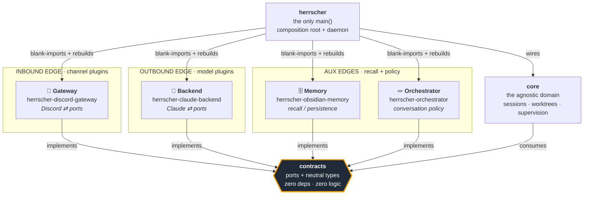
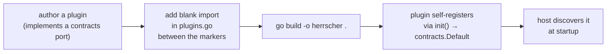
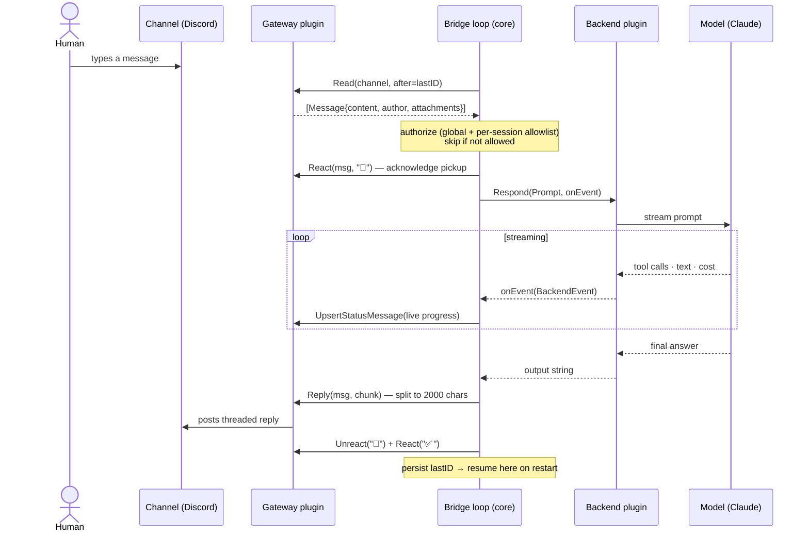
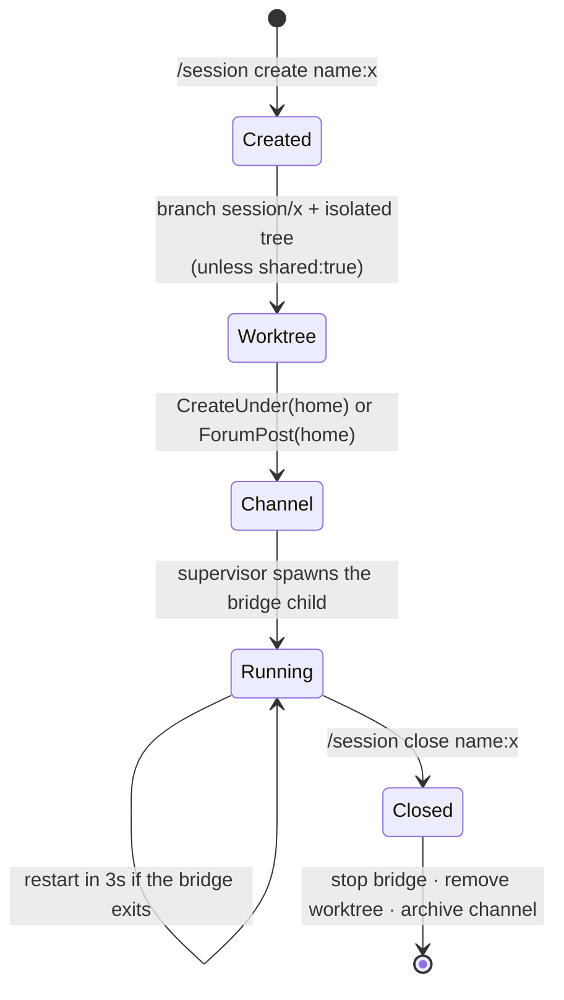

# Herrscher

**A self-hosted bridge between a chat platform and an AI agent.** You run one
daemon. It brings a bot online 24/7, exposes slash commands to spin up isolated
**sessions**, and for each session it turns your messages into prompts, asks a
model, and posts the answer back — streaming tool activity and cost as it goes.
Every session can run in its own git worktree, so an agent works on real code in
isolation.

This is the **single binary**: the agnostic domain (`core`), the composition root
and daemon, and the plugin-management CLI all live here in one module. The
swappable edges — the channel gateway, the model backend, memory and the
orchestrator — stay in their own repos and are compiled in. The host itself is
**gateway-agnostic**: it imports zero `dctl` (the concrete Discord client) and
drives chat platforms only through the contracts `Gateway` port — an invariant
guarded by purity tests (`TestHostPurity`, `TestCorePurity`).

> Built with hexagonal architecture: a narrow contract package in the middle,
> interchangeable edges (the channel, the model), an agnostic domain, and a host
> that bolts them together. Swapping Discord for Slack, or Claude for another
> model, is a one-file wiring change — never a domain rewrite.

---

## Table of contents

- [The mental model](#the-mental-model)
- [Architecture at a glance](#architecture-at-a-glance)
- [The plugin model — four categories](#the-plugin-model--four-categories)
- [The members](#the-members)
- [How a message flows](#how-a-message-flows)
- [The two run modes](#the-two-run-modes)
- [Session lifecycle](#session-lifecycle)
- [Installation](#installation)
- [CLI reference](#cli-reference)
- [Managing plugins](#managing-plugins-the-init--plugin--update--install-verbs)
- [Layout & wiring](#layout--wiring)
- [Configuration](#configuration)
- [Roadmap](#roadmap)

---

## The mental model

Herrscher has exactly **one job**: route. Someone says something on a channel →
the platform figures out which agent session that conversation belongs to →
forwards it to a model → posts the answer back. The domain in the middle
(`core`) never knows *who* is speaking or *which* model answers. It only knows
the **ports** declared in `contracts`.

Two facts hold the whole design together:

1. **`contracts` is the authority.** It dictates the shape every plugin must
   implement, and contains zero platform-specific mechanics. No "Discord", no
   "Claude" — just neutral ports and types.
2. **All dependency arrows point toward `contracts`.** The core depends on no
   edge; the edges depend on no core. Only the host (the binary's `main`) ever
   sees both concrete types at once, in a single wiring file.

---

## Architecture at a glance



**The golden rule** is the arrows above: everything points *in* toward
`contracts`. That is what makes the edges swappable and the domain stable.
Neither the host nor `core` ever imports a concrete adapter: there is no `dctl`
anywhere in this module — it lives only in the Discord gateway plugin. The host
talks to every chat platform through the contracts `Gateway` port, and that
invariant is enforced by `TestHostPurity` (root) and `TestCorePurity` (`core/`),
which fail the build if a concrete client ever leaks in.

---

## The plugin model — four categories

Plugins are compiled **into** the single binary (the [xcaddy] pattern): you add a
blank import and rebuild — no dynamic loading, no separate processes. Each plugin
self-registers into the global `contracts.Default` registry from its `init()`,
before any token or runtime config exists. The host then asks the registry for
what it needs at startup and instantiates it with live config.

[xcaddy]: https://github.com/caddyserver/xcaddy

`contracts` declares **four** plugin categories:

| Category | Edge | Port(s) | Status | Official plugin |
|----------|------|---------|--------|-----------------|
| 🔌 **Gateway** | channel (inbound) | `Gateway`, `ChannelSource`, `ChannelReader`, `ChannelAdmin`, `CommandRegistrar`, `Prober`, `MenuRouter`, `Responder` | ✅ live | [herrscher-discord-gateway] |
| 🧠 **Backend** | model (outbound) | `Backend` (+ `ChoiceAware`, `ChoiceInjector`) | ✅ live | [herrscher-claude-backend] |
| 🗄️ **Memory** | recall / persistence | `Memory` | ✅ live | [herrscher-obsidian-memory] |
| 🪢 **Orchestrator** | conversation policy | `Orchestrator` | ✅ live | [herrscher-orchestrator] |

[herrscher-discord-gateway]: https://github.com/Herrscherd/herrscher-discord-gateway
[herrscher-claude-backend]: https://github.com/Herrscherd/herrscher-claude-backend
[herrscher-obsidian-memory]: https://github.com/Herrscherd/herrscher-obsidian-memory
[herrscher-orchestrator]: https://github.com/Herrscherd/herrscher-orchestrator

All four categories have an official plugin. **Orchestrator** is a
conversation-policy port; the default stack ships the published
`herrscher-orchestrator` module (the `basic` kind). Every plugin plugs in the
same way — a blank import and a rebuild, no domain change.



Optional ports may be **nil**: the host wraps the gateway in a degrading decorator
(`contracts.Degrade`) so a plugin that can't, say, render select-menus simply
falls back to plain text instead of crashing.

---

## The members

This repo holds the **binary** and everything agnostic that ships inside it. One
external module stays separate by design: `contracts`, so third-party plugins can
import the ports without pulling in the host.

| Location | Repo | Role |
|----------|------|------|
| `core/` (this repo) | — | The agnostic domain: sessions, channels, worktrees, supervision. |
| `main.go`, `serve.go`, … (this repo) | — | The composition root and daemon — gateway-agnostic, drives platforms only through the `Gateway` port. |
| `manage/` (this repo) | — | The plugin-composition CLI (`init` / `plugin` / `update` / `install`). |
| external module | [herrscher-contracts] | The ports: interfaces + neutral types. Zero deps, zero logic. |

[herrscher-contracts]: https://github.com/Herrscherd/herrscher-contracts

The **edges** are interchangeable plugins, each its own repo, **not** part of the
binary's module — they are the official Gateway, Backend, Memory and Orchestrator
listed in the table above. [`dctl`] is not a family member either: it is the
pure, dependency-free Discord REST client (v10) the **gateway plugin** consumes —
no gateway socket, no CLI, just on-demand HTTP. The host never imports it (it
shows up only as an *indirect* dependency, pulled in transitively by the gateway
plugin).

[`dctl`]: https://github.com/Herrscherd/dctl

---

## How a message flows

End to end, from a human typing in a channel to the reply landing back:



If the model hits a permission prompt mid-turn, the backend exposes a
`PendingChoice`; when a control socket and the `MenuRouter` capability are both
present, the bridge posts a **select menu** keyed to the session, the daemon
forwards the click back over the socket, and the choice is injected into the live
session (`InjectChoice`). Otherwise it degrades to a plain-text prompt.

---

## The two run modes

The same binary runs in two shapes. **`serve`** is the always-on daemon you
install as a service; it supervises one **`bridge`** child process per session.

> **Command surface (current):** session and service commands now run through the
> operator **CLI** (`herrscher session create|close|list|who`, `herrscher service
> restart|update`) dispatched by a neutral `contracts.Cmd` registry, not Discord
> slash commands. The `serve` daemon supervises sessions and serves health; it no
> longer dispatches slash interactions. Discord slash binding (and the `set` /
> `allow` / `workspace` surfaces) is being re-platformed and returns in the dctl
> phase. The slash-flavoured diagrams below describe that future shape.

### `serve` — the always-on daemon


### `bridge` — the per-session poll loop


State (the last-seen message id) is persisted every message, so a restarted
bridge resumes exactly where it left off. Authorization re-reads the daemon's
`state.json` only when the file's mtime changes — cheap per-poll.

---

## Session lifecycle

A **session** is the unit of work: a channel + an agent + (optionally) an isolated
git worktree, supervised by a long-lived bridge.



- `project:` picks an existing repo from your workspace; `clone:` forges one
  first (gh/glab). `shared:true` skips the worktree and runs in the main checkout.
- `/session close` refuses to delete a worktree with uncommitted work unless you
  pass `force:true`.
- `/session allow` and `/allow` gate who may *drive* a session; everyone else is
  observed (journaled for `/session who`) but never executes.

---

## Installation

### Prerequisites

- Go 1.25+
- A Discord bot token (the default Gateway is Discord)

```bash
# a fresh clone builds on its own — go.mod points at published, tagged
# modules from github.com/Herrscherd, so the proxy resolves the plugins.
git clone https://github.com/Herrscherd/herrscher.git
```

(For cross-repo development against local checkouts, see [Layout &
wiring](#layout--wiring) — use a `go.work` workspace, not `replace` directives.)

### Build the single binary

```bash
cd herrscher
go build -o herrscher .          # the only binary; plugins are compiled in
```

### Install system-wide (Arch / pacman)

The repo ships a `PKGBUILD`, so on Arch-based systems you can build and install
under pacman management:

```bash
makepkg -si                      # builds and installs /usr/bin/herrscherd
```

The packaged binary is named `herrscherd`.

### Run it directly (foreground)

```bash
export DISCORD_BOT_TOKEN=...      # required
export DCTL_OWNER_ID=...          # optional: seeds the allowlist with you

./herrscher serve --health-addr :8787
```

Then in Discord: `/set home #your-category`, `/session create name:hello`, and
start talking in the session channel.

### Install as a boot-started service (recommended)

`herrscher service install` writes a native service for your OS and a `0600`
secrets template — it never bakes the token into the unit file.

```bash
./herrscher service install \
  --cmd "claude --model claude-opus-4-8 --effort low" \
  --health-addr :8787
```

| OS | What it creates |
|----|-----------------|
| **Linux** | systemd **user** unit `~/.config/systemd/user/dctl.service` (`Restart=always`), enables it, runs `loginctl enable-linger` so it survives logout |
| **macOS** | launchd LaunchAgent `~/Library/LaunchAgents/com.vskstudio.dctl.plist` (`RunAtLoad`, `KeepAlive`) |
| **Windows** | a Task Scheduler task `dctl` (on-logon trigger) wrapping `herrscher serve` |

It also scaffolds (never clobbering existing files):

- `~/.config/dctl/dctl.env` — the secrets file the service sources
  (`DISCORD_BOT_TOKEN=`, `DISCORD_CHANNEL_ID=`, `DCTL_OWNER_ID=`)
- `~/.config/dctl/config.json` — the config template (see [Configuration](#configuration))

Then fill the token and (re)start:

```bash
$EDITOR ~/.config/dctl/dctl.env      # set DISCORD_BOT_TOKEN
./herrscher service restart
./herrscher service status
```

### Update an installed service

```bash
cd herrscher
./herrscher service update           # git pull --ff-only, rebuild the installed binary, restart
./herrscher service update --no-pull # rebuild from local source only
```

`service update` rebuilds the **installed** binary (not the one you invoked) and
schedules the restart out-of-band (on Linux via `systemd-run`), so it survives the
daemon being killed mid-restart.

### Uninstall

```bash
./herrscher service uninstall        # disable + remove the unit (leaves your config/secrets)
```

---

## CLI reference

`herrscher <command>`. Output is deliberately minimal (ids and one-line
messages) so an agent reading stdout spends few tokens. The host exposes no raw
channel verbs of its own — all chat I/O goes through the active gateway plugin's
`Gateway` port; the low-level Discord poking lives in `dctl`, consumed by the
gateway plugin alone.

| Command | What it does |
|---------|--------------|
| `serve [--config PATH] [--state FILE] [--health-addr ADDR] [--status-channel ID] [--env-file PATH] [--instance SLUG] [--cmd '…']` | The always-on Gateway daemon: per-session bridge supervision, health endpoint. |
| `bridge -c CHANNEL [--cmd '…'] [--backend stream\|oneshot] [--model M] [-i 5] [--state FILE] [--progress off\|actions\|full] …` | One channel ⇄ one backend poll loop. Normally spawned by `serve`, runnable standalone. |
| `session <create\|close\|list\|who> [--name N] [--project P] [--clone R] [--cmd '…'] [--backend stream\|oneshot] [--shared] [--force]` | Manage sessions: create a bridged channel + worktree + backend, close one, or list/inspect active ones. |
| `service <install\|uninstall\|status\|restart\|update> [--cmd '…'] [--health-addr ADDR] [--env-file PATH] [--source DIR] [--no-pull]` | Manage the daemon as a native OS service (see [Installation](#installation)). |

The host self-management verbs — `init`, `plugin`, `update`, `install` — compose
and maintain the compiled-in plugin set; see [Managing
plugins](#managing-plugins-the-init--plugin--update--install-verbs).

**Environment:** the **active gateway plugin declares its own required vars** (the
Discord gateway needs `DISCORD_BOT_TOKEN`); the host resolves them generically.
Common ones: `DISCORD_BOT_TOKEN`, `DISCORD_CHANNEL_ID` (default channel),
`DCTL_OWNER_ID` (seed allowlist), `DCTL_STATE_DIR` (state dir, default
`~/.config/dctl`), `DCTL_INSTANCE_ID` (namespace slug for shared resources). All
of these can be supplied via the root `.env` (see [Configuration](#configuration)).

---

## Managing plugins (the `init` / `plugin` / `update` / `install` verbs)

The same binary manages its own plugin composition (the `manage/` package). These
verbs do **not** run the runtime; they edit `plugins.go` (the blank-import list
between the `herrscher:plugins` / `herrscher:end` markers) and rebuild.

### `init` — compose the stack from a catalog

`herrscher init` builds a fresh plugin stack from a built-in **catalog** of
published modules, picking **one kind per category** (gateway / backend / memory /
orchestrator). With no flags it writes the batteries-included **default stack**:
`discord` + `claude` + `obsidian` + `orchestrator` (`basic`). It rewrites
`plugins.go` to exactly that set, seeds a `.env` from `.env.example` (never
clobbering an existing one), then `go get`s each module, `go mod tidy`s and
rebuilds. If the build fails it restores the original `plugins.go`.

**Interactive wizard.** Run on a terminal with no stack flags, `herrscher init`
prompts for each category (pick a kind or `none`) then reads the active gateway's
secrets — the Discord bot token is read with **echo disabled**, so it never
appears on screen — and upserts them into `.env` (existing keys preserved). Pass
`--yes`, any stack flag, or run non-interactively (a service/CI pipe) to skip the
wizard and take the flags/defaults silently.

When `init` finds **no source checkout** (the common case for a pacman-installed
binary, whose plugins are already compiled in) it runs in **config-only** mode:
it skips the plugin menu and the rebuild, collecting only the gateway secrets and
writing them to `$HERRSCHER_ENV_FILE` (else `./.env`), then points you at
`herrscherd serve`.

```bash
herrscher init                                     # interactive wizard on a tty, else default stack
herrscher init --yes                               # the default stack, no prompts, then build
herrscher init --list                              # print the module catalog and exit
herrscher init --memory none --orchestrator none   # drop a category ("none"), no wizard
herrscher init --backend claude --with github.com/acme/extra-plugin   # pin an extra module
herrscher init --no-build                           # rewrite plugins.go + seed .env only
```

Flags: `--gateway/--backend/--memory/--orchestrator K` choose the kind for a
category (or `none` to drop it), `--with MODULE` pins an extra module path
verbatim (repeatable), `--list` prints the catalog, `--no-build` stops after
writing `plugins.go`, `--yes` skips the wizard.

### `plugin` / `update` / `install`

```bash
herrscher plugin list                              # compiled-in plugins
herrscher plugin add github.com/acme/slack-gateway # blank-import, go get, tidy, build
herrscher plugin remove github.com/acme/slack-gateway
herrscher update                                   # go get -u every plugin, tidy, rebuild
herrscher install -- --health-addr :8787           # build the host, then delegate to `service install`
```

`herrscher update` refreshes the **plugin** modules (the counterpart to
`herrscher service update`, which pulls the host's own source). `herrscher
install` builds the binary then forwards everything after `--` to `herrscher
service install` — it never reimplements the systemd/launchd glue.

---

## Layout & wiring

The binary is one Go module (`core/`, `manage/`, and the root `main` package).
The contracts module and the edge plugins are separate modules. There are **no
`replace` directives**: the committed `go.mod` references **published, tagged
modules** from `github.com/Herrscherd`, so a fresh clone builds straight from the
module proxy with nothing checked out beside it.

For local multi-repo development you stitch the siblings together with a **`go.work`
workspace** (untracked) instead of replaces:

```
herrscher-dev/
├── go.work                    ← `go work use ./herrscher ./herrscher-contracts …` (local only)
├── herrscher/                 ← the only main(); core + manage + plugins.go (this repo)
│   ├── core/                  ← the agnostic domain
│   └── manage/                ← the plugin-composition CLI
├── herrscher-contracts/       ← the ports (separate module)
├── herrscher-discord-gateway/ ← Gateway plugin (separate module)
├── herrscher-claude-backend/  ← Backend plugin (separate module)
├── herrscher-obsidian-memory/ ← Memory plugin (separate module)
├── herrscher-orchestrator/    ← Orchestrator plugin (separate module)
└── dctl/                      ← the gateway plugin's Discord REST client
```

The workspace redirects the published module paths to the local checkouts while
you hack across repos; remove it (or `GOWORK=off`) to build against the tagged
releases exactly as a fresh clone would.

---

## Configuration

Precedence, highest first: **CLI flag → environment → `config.json` → built-in
default**. The service sources secrets from a separate `0600` env file so they
never live in the unit.

### The root `.env`

At startup the host auto-loads a project-root **`.env`** so every command — and
every plugin's config resolution — sees its vars without an explicit
`--env-file`. A real environment variable always wins over the file. The path is
overridable with **`$HERRSCHER_ENV_FILE`**; it is resolved to an absolute path and
re-exported, so each `bridge` subprocess (which runs with its working directory
set to a per-session worktree) loads the *same* file rather than a stray `.env`
sitting in that tree. The implicit `./.env` is best-effort (a missing file is not
an error), while an explicit `$HERRSCHER_ENV_FILE` is authoritative — a load
failure there is fatal. A `.env.example` ships as a fill-in skeleton; `herrscher
init` seeds `.env` from it. Which keys are required depends on the active gateway
plugin (the Discord gateway needs `DISCORD_BOT_TOKEN`).

`~/.config/dctl/config.json`:

```json
{
  "cmd": "claude --model claude-opus-4-8 --effort low",
  "healthAddr": ":8787",
  "statusChannel": "",
  "instance": "",
  "owner": "",
  "home": { "id": "category_or_forum_id", "type": "category" },
  "workspace": "/path/to/projects",
  "source": "/path/to/herrscher/checkout"
}
```

- `cmd` — the base bridged command for new sessions (a per-session `cmd:` overrides it).
- `home` — where `/session create` puts channels (a category or a forum), set via `/set home`.
- `workspace` — root scanned for `project:` and shown by `/workspace list`.
- `source` — checkout `/service update` rebuilds from.

---

## Roadmap

- **Discord slash binding** — re-platforming the session/service surface back onto
  Discord slash commands (returning in the dctl phase; see [The two run
  modes](#the-two-run-modes)).
- **More catalog kinds** — additional gateway/backend/memory/orchestrator modules
  in the `herrscher init` catalog beyond the current defaults.
- **Distributed transport** — the in-process registry (`Manifest`, factories) is
  shaped so the channel/model/domain split can later run over **NATS/gRPC** as a
  wiring change, not a rewrite.

---

## A note on history

The platform grew out of a Go monolith (`dctl`) that bridged Discord to a local
Claude. Herrscher is that monolith decomposed along its natural seams — channel,
model, domain — so each can evolve independently. The contract shapes were chosen
deliberately to make the eventual transport change (in-process → NATS/gRPC) a
detail, not a rewrite.
